<p></p>
<p>Created during a computer <strong>Software Engineering</strong> during the third year at <em>Ariel University</em> in the Department of Computer Science, 2019 <br /> <strong>Project site:</strong>&nbsp;<a href="https://github.com/ZviMints/RentMe">https://github.com/ZviMints/RentMe</a><br /> <strong>Made by: </strong> <a href="https://github.com/ZviMints">Zvi Mints</a>, <a href="https://github.com/eilon26">Eilon Tsadok</a>, and <a href="https://github.com/orabu103">Or Abuhazira</a></p>
<h1>About The Project:</h1>
<p>
  A social application that enables the rental and sale of products
</p>
<h1>Gallery:</h1>
<p style="text-align: center;"><strong>Quick Overview:</strong></p>
<table>
  <tr>
    <td>
      
    </td>
    <td>

    </td>
                                                         <td>
      
    </td>
  </tr>
  </table>
<p style="text-align: center;"><strong>More Photos:</strong></p>
<table cellspacing="10">
<tbody>
<tr>
<td>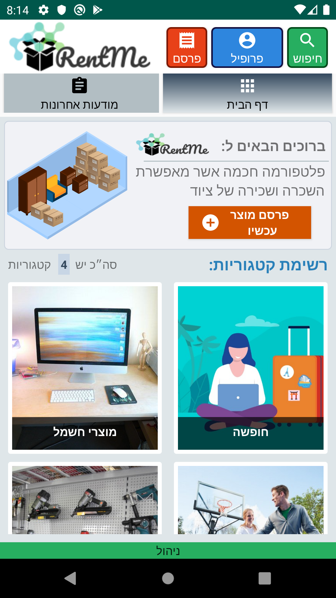</td>
<td>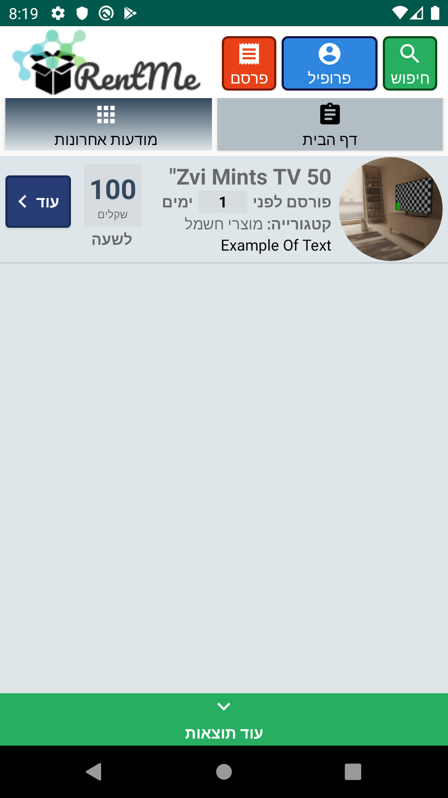</td>
<td>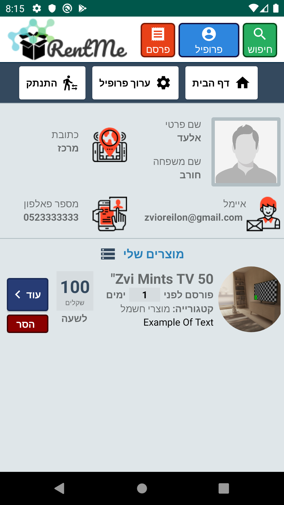</td>
<td></td>
</tr>
<tr>
<td>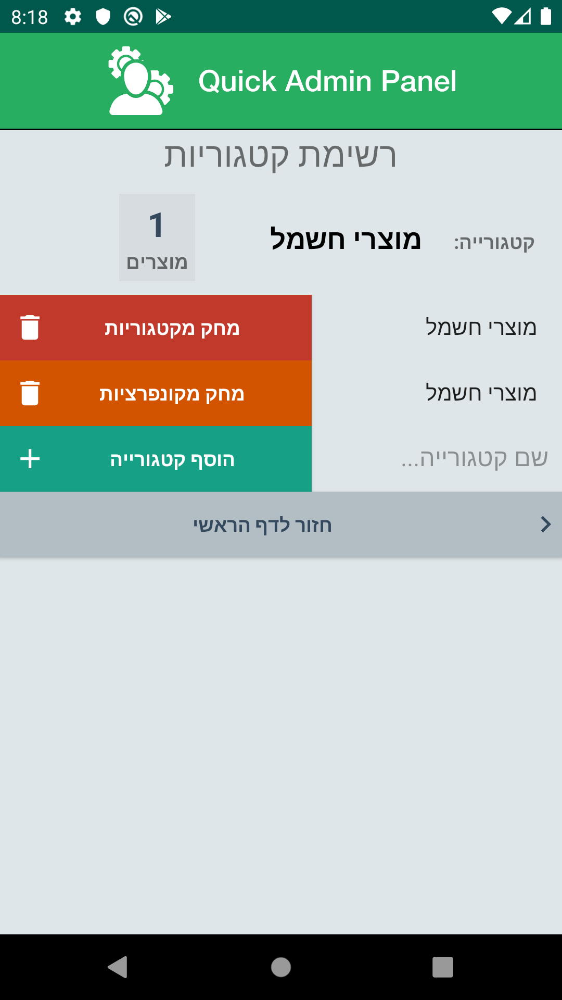</td>
<td>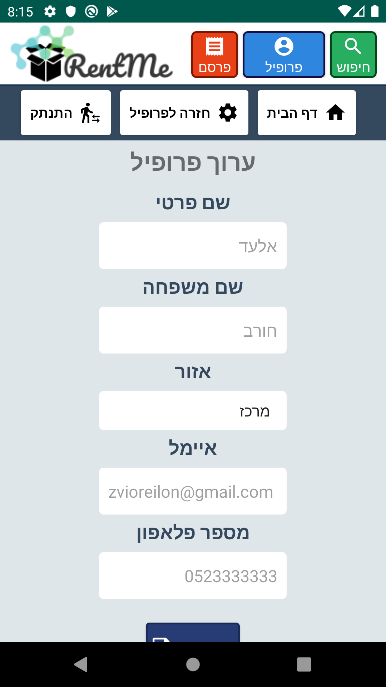</td>
<td>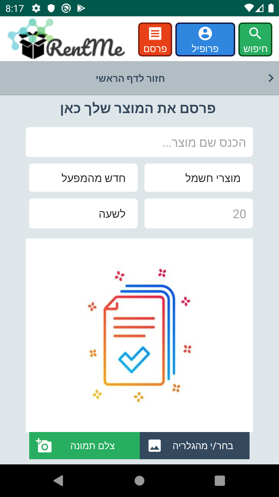</td>
<td>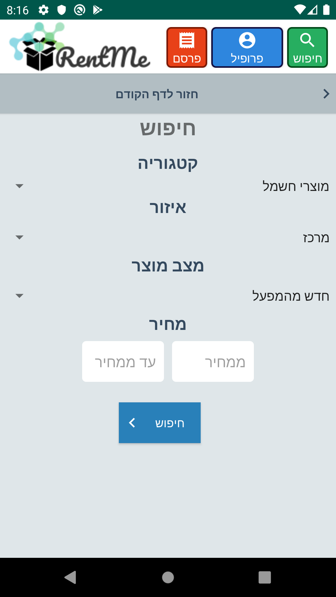</td>
</tr>
<tr>
<td>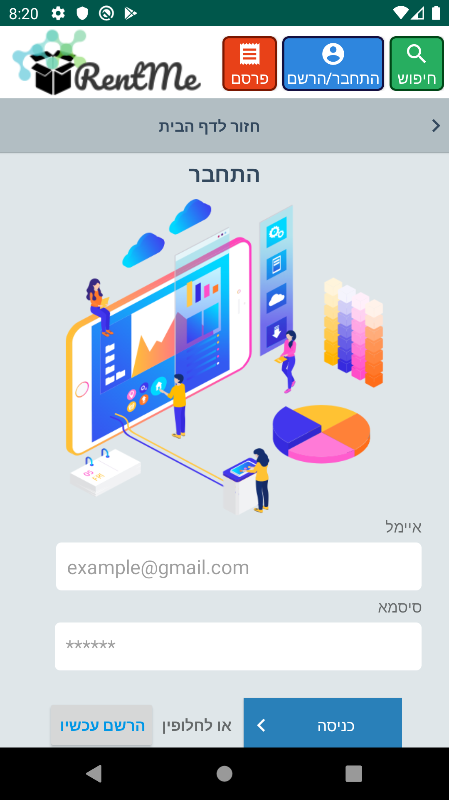</td>
<td>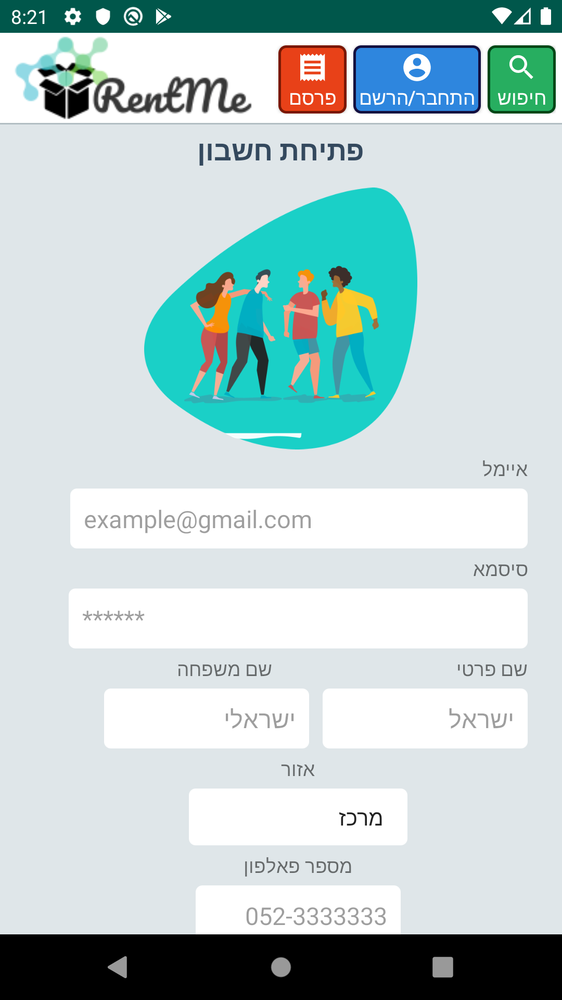</td>
<td>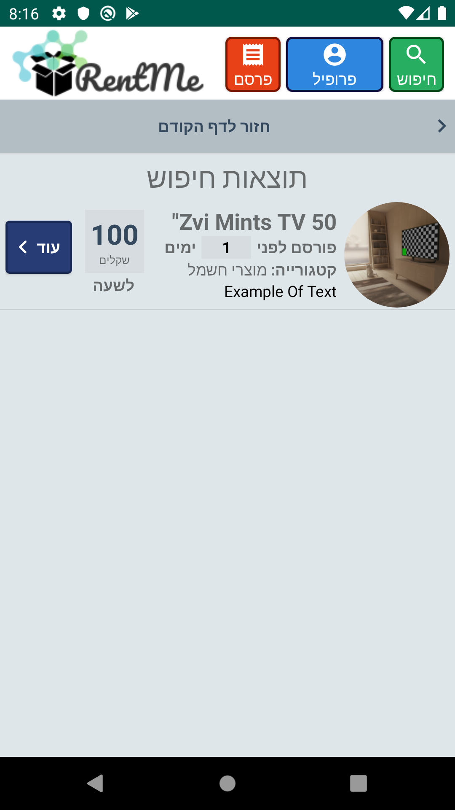</td>
<td></td>
</tr>
</tbody>
</table>
<h1>Use Case Diagram:</h1>
<p></p>
<h1>Technology:</h1>
<table cellspacing="10">
  <tr>
    <td></td>
    <td></td>
    <td></td>
        <td></td>
    </tr>
    </table>
<h1>Class Diagram</h1>
<p><a href="./images/RentMeClassDiagram.jpeg">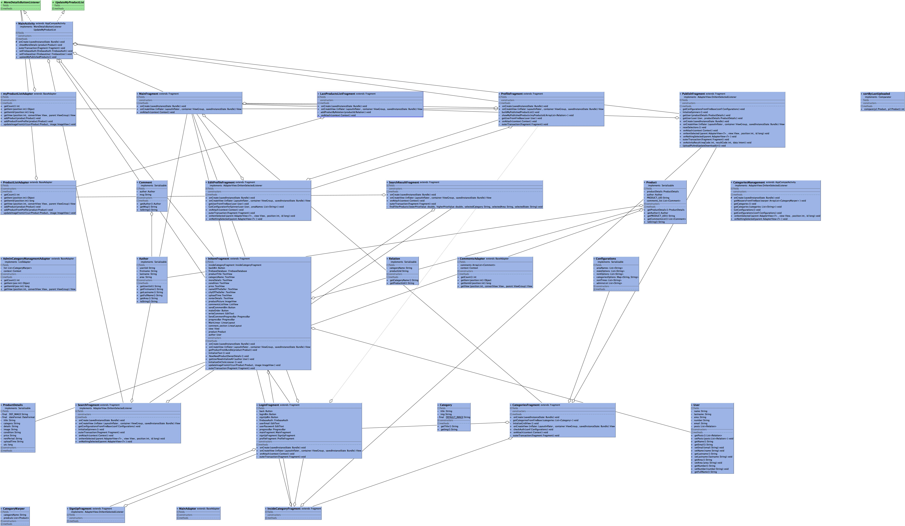</a></p>
<h1>Features:</h1>
<p>The application supports the following features:</p>
<ul>
<li>Publish a&nbsp;<em><strong>Product&nbsp;</strong></em>which includes:
<ul>
<li>Name, Category, Details, Image (can be uploaded from Gallery, Camera Shot), Area and etc</li>
</ul>
</li>
<li>Search for a&nbsp;<em><strong>Product&nbsp;</strong></em>by fields</li>
<li>Login Activity</li>
<li>Sign In Activity</li>
<li>Profile Activity<br />
<ul>
<li>Possibility to edit profile</li>
</ul>
</li>
<li>Last Products List (by Date)</li>
<li>Admin Management Panel</li>
</ul>
<p><strong>&nbsp; &nbsp; And Much More!</strong></p>
<h1>Firebase Exported JSON:</h1>

Can be imported into Firebase

```
{
  "Categories" : {
    "חופשה" : {
      "1575925076784: TV 50\"" : {
        "author" : {
          "area" : "מרכז",
          "firstname" : "אלעד",
          "fullName" : "אלעד חורב",
          "lastname" : "חורב",
          "userUid" : "5AvwrkLTrSaj6bK9mAYU3YYxZFx1"
        },
        "productDetails" : {
          "category" : "חופשה",
          "condition" : "חדש מהמפעל",
          "details" : "Example Text",
          "image" : "https://firebasestorage.googleapis.com/v0/b/rentme-cdf84.appspot.com/o/product%2F1575925067233.jpg?alt=media&token=ee3be1af-e1c5-4872-b146-eac3656c38a6",
          "price" : "20",
          "rentPeriod" : "לחודש",
          "title" : "TV 50\"",
          "uploadTime" : "2019/12/09 20:57:56",
          "utc" : 1575925076784
        },
        "product_UID" : "1575925076784: TV 50\""
      }
    },
    "מוצרי חשמל" : {
      "1575780921265: Zvi Mints TV 50\"" : {
        "author" : {
          "area" : "מרכז",
          "firstname" : "אלעד",
          "fullName" : "אלעד חורב",
          "lastname" : "חורב",
          "userUid" : "5AvwrkLTrSaj6bK9mAYU3YYxZFx1"
        },
        "comments_list" : [ {
          "author" : {
            "area" : "מרכז",
            "firstname" : "אלעד",
            "fullName" : "אלעד חורב",
            "lastname" : "חורב",
            "userUid" : "5AvwrkLTrSaj6bK9mAYU3YYxZFx1"
          },
          "msg" : "בבב"
        }, {
          "author" : {
            "area" : "מרכז",
            "firstname" : "אלעד",
            "fullName" : "אלעד חורב",
            "lastname" : "חורב",
            "userUid" : "5AvwrkLTrSaj6bK9mAYU3YYxZFx1"
          },
          "msg" : "תגובה\n"
        } ],
        "productDetails" : {
          "category" : "מוצרי חשמל",
          "condition" : "חדש מהמפעל",
          "details" : "Example Of Text",
          "image" : "https://firebasestorage.googleapis.com/v0/b/rentme-cdf84.appspot.com/o/product%2F1575780909252.jpg?alt=media&token=672f0a86-1c63-4922-a935-9715f5cf1d8d",
          "price" : "100",
          "rentPeriod" : "לשעה",
          "title" : "Zvi Mints TV 50\"",
          "uploadTime" : "2019/12/08 06:55:21",
          "utc" : 1575780921265
        },
        "product_UID" : "1575780921265: Zvi Mints TV 50\""
      }
    }
  },
  "Configurations" : {
    "configurations" : {
      "adminsList" : [ "zvioreilon@gmail.com" ],
      "areaNames" : [ "מרכז", "דרום", "צפון", "השרון" ],
      "categoriesOptions" : {
        "חופשה" : "https://i.ibb.co/1GHJMtW/vacation.jpg",
        "כלי עבודה" : "https://www.osheastimber.com.au/wp-content/gallery/powertools/osheas-power-tools-display.jpg",
        "מוצרי חשמל" : "https://foxnomad.com/wp-content/uploads/2011/02/desktop-computer.jpg",
        "ספורט" : "https://i.ibb.co/nQfg5r7/sport.jpg"
      },
      "rentOptions" : [ "לשעה", "ליום", "לשבוע", "לחודש", "לשנה", "בלי הגבלה" ],
      "rentTimes" : [ "יום", "שבוע" ],
      "stateOptions" : [ "חדש מהמפעל", "חדש", "כמו חדש", "משומש", "שבור" ]
    }
  },
  "Last Products" : {
    "1575730003036: עכבר" : {
      "categoryName" : "מוצרי חשמל",
      "productUid" : "1575730003036: עכבר"
    },
    "1575730054398: ריק" : {
      "categoryName" : "ספורט",
      "productUid" : "1575730054398: ריק"
    },
    "1575730154875: מחשב" : {
      "categoryName" : "אביזרים",
      "productUid" : "1575730154875: מחשב"
    },
    "1575733163771: לדרמן" : {
      "categoryName" : "כלי עבודה",
      "productUid" : "1575733163771: לדרמן"
    },
    "1575733194630: מחשב" : {
      "categoryName" : "מוצרי חשמל",
      "productUid" : "1575733194630: מחשב"
    },
    "1575733261163: משקולות" : {
      "categoryName" : "ספורט",
      "productUid" : "1575733261163: משקולות"
    },
    "1575733295342: נעלי ספורט" : {
      "categoryName" : "ספורט",
      "productUid" : "1575733295342: נעלי ספורט"
    },
    "1575734167145: קומקום חשמלי" : {
      "categoryName" : "מוצרי חשמל",
      "productUid" : "1575734167145: קומקום חשמלי"
    },
    "1575734994193: פקךל קפה" : {
      "categoryName" : "ציוד טיולים",
      "productUid" : "1575734994193: פקךל קפה"
    },
    "1575780921265: Zvi Mints TV 50\"" : {
      "categoryName" : "מוצרי חשמל",
      "productUid" : "1575780921265: Zvi Mints TV 50\""
    },
    "1575925076784: TV 50\"" : {
      "categoryName" : "חופשה",
      "productUid" : "1575925076784: TV 50\""
    }
  },
  "Users" : {
    "5AvwrkLTrSaj6bK9mAYU3YYxZFx1" : {
      "area" : "מרכז",
      "email" : "zvioreilon@gmail.com",
      "lastname" : "חורב",
      "name" : "אלעד",
      "number" : "0523333333",
      "posts_list" : [ {
        "categoryName" : "מוצרי חשמל",
        "productUid" : "1575780921265: Zvi Mints TV 50\""
      }, {
        "categoryName" : "חופשה",
        "productUid" : "1575925076784: TV 50\""
      } ]
    },
    "MF7K6giCAiY35nIw15mfV3sKRN62" : {
      "area" : "מרכז",
      "email" : "ei@gmail.com",
      "fullName" : "Ei Ts",
      "lastname" : "Ts",
      "name" : "Ei",
      "number" : "050483",
      "posts_list" : [ {
        "categoryName" : "מוצרי חשמל",
        "productUid" : "1575725562617: ריק "
      }, {
        "categoryName" : "מוצרי חשמל",
        "productUid" : "1575730003036: עכבר"
      }, {
        "categoryName" : "ספורט",
        "productUid" : "1575730054398: ריק"
      }, {
        "categoryName" : "אביזרים",
        "productUid" : "1575730154875: מחשב"
      }, {
        "categoryName" : "כלי עבודה",
        "productUid" : "1575733163771: לדרמן"
      }, {
        "categoryName" : "מוצרי חשמל",
        "productUid" : "1575733194630: מחשב"
      }, {
        "categoryName" : "ספורט",
        "productUid" : "1575733261163: משקולות"
      }, {
        "categoryName" : "ספורט",
        "productUid" : "1575733295342: נעלי ספורט"
      }, {
        "categoryName" : "ציוד טיולים",
        "productUid" : "1575734994193: פקךל קפה"
      } ]
    },
    "ouIC4DovN2NRINQU2xNKteH33jL2" : {
      "area" : "דרום",
      "email" : "zvimints@gmail.com",
      "fullName" : "צבי מינץ",
      "lastname" : "מינץ",
      "name" : "צבי",
      "number" : "0523348262",
      "posts_list" : [ {
        "categoryName" : "ספורט",
        "productUid" : "1575726203843: Example"
      }, {
        "categoryName" : "ספורט",
        "productUid" : "1575726228963: Example Sport"
      }, {
        "categoryName" : "אביזרים",
        "productUid" : "1575726252393: Example For Other"
      } ]
    },
    "rh7ZQ1CXzdTlmEYziBWdpVuKiPm2" : {
      "area" : "צפון",
      "email" : "eilon26@gmail.com",
      "fullName" : "אילון צדוק",
      "lastname" : "צדוק",
      "name" : "אילון",
      "number" : "087999777",
      "posts_list" : [ {
        "categoryName" : "מוצרי חשמל",
        "productUid" : "1575734167145: קומקום חשמלי"
      } ]
    }
  }
}
```
