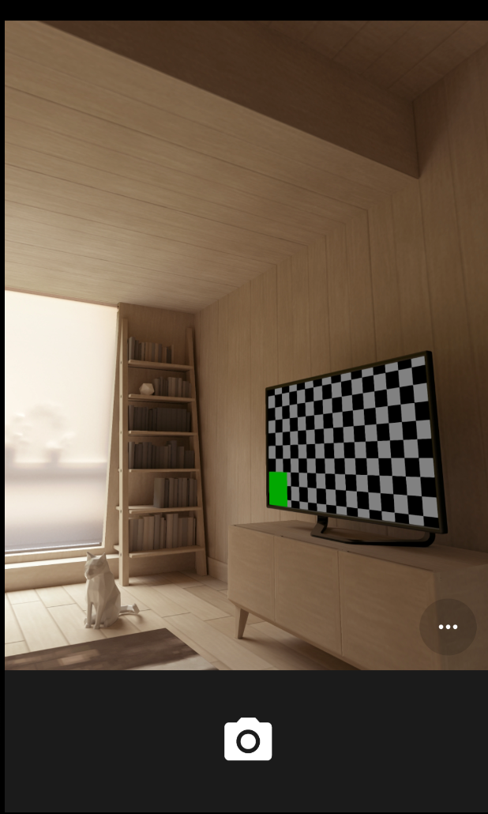
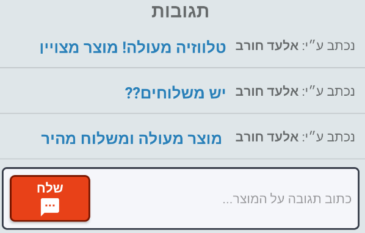
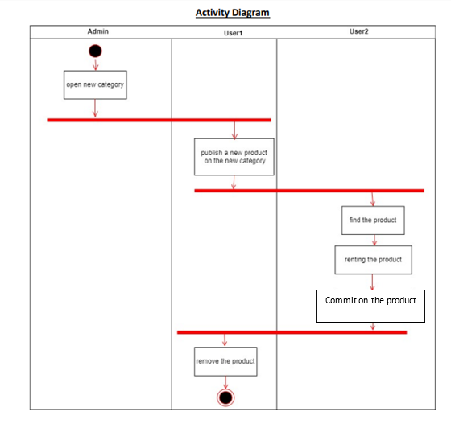

Created during a computer <strong>Software Engineering</strong> during the third year at <em>Ariel University</em> in the Department of Computer Science, 2019   <strong>Project site:</strong>&nbsp;<a href="https://github.com/ZviMints/RentMe">https://github.com/ZviMints/RentMe</a>  <strong>Made by: </strong> <a href="https://github.com/ZviMints">Zvi Mints</a>, <a href="https://github.com/eilon26">Eilon Tsadok</a>, and <a href="https://github.com/orabu103">Or Abuhazira</a>

<h1>About The Project:</h1>
<h3>A social application that enables rental and sales products.</h3>

The app built to facilitate the renters' audience and allow the public to rent items and to avoid buying a one-time use product or for a short period.

<h4>The lessor :</h4>

First, you'll need to download the app to your personal device, create a trusted profile that includes identification details and then you can add all the items you would like to rent or to share with others. 
In the process of adding new items, you will asked to enter the category, price, usage status, image, and notes.

<h4>The Rent Process :</h4>

First, you should download the app and then you'll need to enter prenasal details. 
After you'll create a profile you'll be able to start searching for items you need.
 
During your search You can choose from a number of filter types: 
 
price range, item status, area, etc.
By clicking on "Search", the list of all products that meet your requirements will appear, if you'll click on one of them, the contact details with the lessor will appear.

<h4>Finally :</h4>

when you'll finish using to product, the app will ask you to rate the quality of the product and service you received from the lessor in order to keep this platform user-friendly and useful app.

<h1>Gallery:</h1>

<strong>Quick Overview:</strong>

<table>
<tbody>
<tr>
<td></td>
<td></td>
<td></td>
</tr>
</tbody>
</table>

<strong>More Photos:</strong>

<table cellspacing="10">
<tbody>
<tr>
<td></td>
<td></td>
<td></td>
<td></td>
</tr>
<tr>
<td></td>
<td></td>
<td></td>
<td></td>
</tr>
<tr>
<td></td>
<td></td>
<td></td>
<td></td>
</tr>
<tr>
<td></td>
<td></td>
<td></td>
</tr>
</tbody>
</table>
<h1>Features:</h1>

The application supports the following features:

<ul>
<li>Publish a&nbsp;<em><strong>Product&nbsp;</strong></em>which includes:
<ul>
<li>Name, Category, Details, Image (can be uploaded from Gallery, Camera Shot), Area and etc</li>
</ul>
</li>
<li>Search for a&nbsp;<em><strong>Product&nbsp;</strong></em>by fields</li>
<li>Login Activity</li>
<li>Sign In Activity</li>
<li>Profile Activity 
<ul>
<li>Possibility to edit profile</li>
</ul>
</li>
<li>Last Products List (by Date)</li>
<li>Admin Management Panel</li>
</ul>

<strong>&nbsp; &nbsp; And Much More!</strong>

<h1>Selected Features:</h1>
Upload Image from <strong>Gallery/Camera:</strong></li>
<table cellspacing="10">
<tbody>
<tr>
<td></td>
<td></td>
<td></td>
</tr>
</tbody>
</table>

Admin<strong> Broadcast </strong>Message that follows by<strong> Notification</strong>

<table cellspacing="10">
<tbody> 
<tr>
<td></td>
<td></td>
<td></td>
</tr>
</tbody>
</table>

<strong>Chat</strong>:

<h1>Diagrams:</h1>
<table cellspacing="10">
<tbody>
<tr>
<td style="text-align: center;">

<strong>ERD Diagram</strong>

<a href="./images/ERD.png">Full Size</a></td>
<td style="text-align: center;">

<strong>Use Case Diagram</strong>

<a href="./images/Use Case Diagram.png">Full Size</a></td>
<td style="text-align: center;">

<strong>Object Diagram</strong>

<a href="./images/ObjectDiagram.png">Full Size</a></td>
<td style="text-align: center;">

<strong>Activity Diagram</strong>

<a href="./images/activity.png">Full Size</a></td>
</tr>
<tr>
<td style="text-align: center;">

<strong>Class Diagram</strong>

<a href="./images/RentMeClassDiagram.jpeg">Full Size</a></td>
<td style="text-align: center;">

<strong>Sequence Diagram</strong>

<a href="./images/Sequence.png">Full Size</a></td>
<td style="text-align: center;">

<strong>State Machine Diagram</strong>

<a href="./images/State.png">Full Size</a></td>
</tr>
</tbody>
</table>
<h1>Technology:</h1>
<table cellspacing="10">
<tbody>
<tr>
<td></td>
<td></td>
<td></td>
<td></td>
<td style="text-align: center;"> Git <strong>Branches</strong></td>
</tr>
<tr>
<td style="text-align: center;"></td>
<td style="text-align: center;"> <strong>Client-Server</strong> Model</td>
<td style="text-align: center;">  Agile Methodology - <strong>Scrum</strong></td>
<td style="text-align: center;"> Monday.com <strong>Board</strong></td>
</tr>
</tbody>
</table>
<h1>Firebase Exported JSON:</h1>

Can be imported into Firebase

<h1>How to use:</h1>

Clone the project and run the app 

